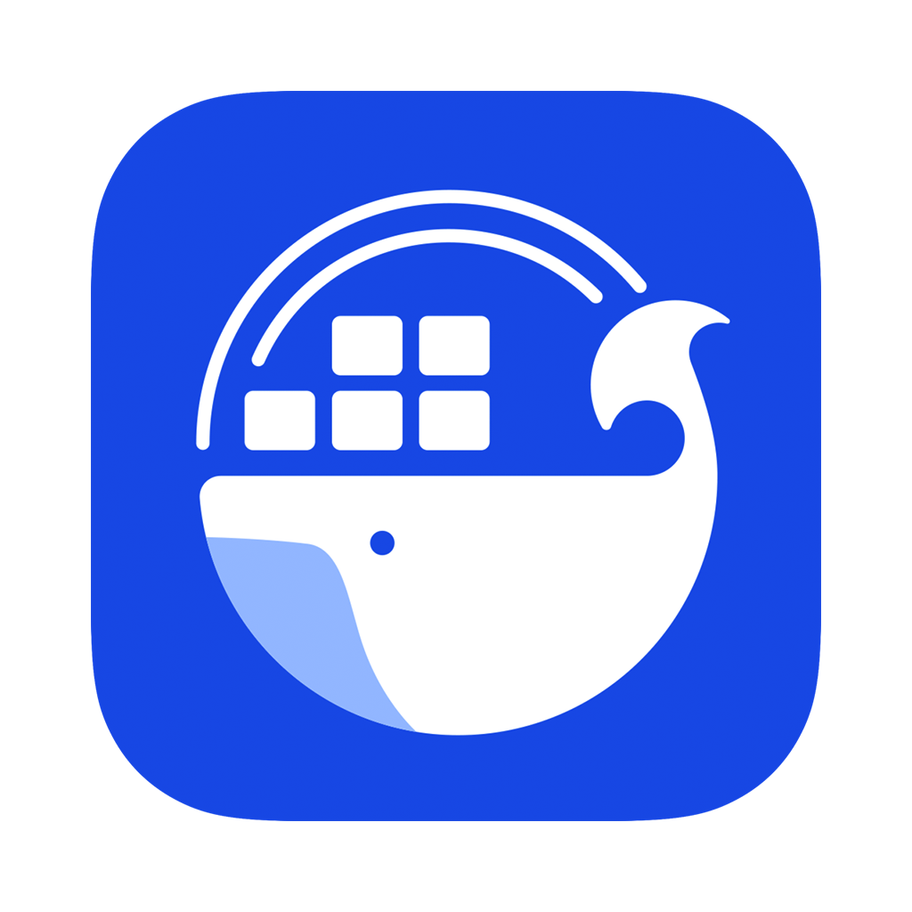
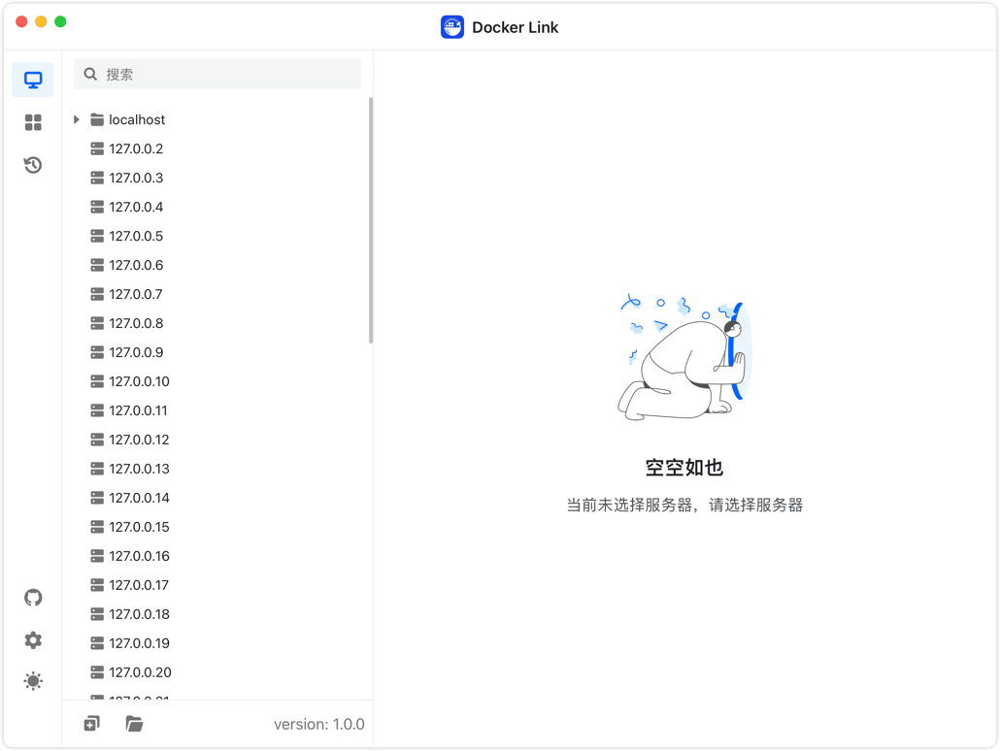

<h4 align="right"><strong><a href="https://github.com/DLinkProjects/DLink/blob/main/README.md">English</a></strong> | 简体中文</h4>

<h1 align="center">Docker Link（开发中）</h1>

<strong>一个简单轻量的Docker桌面端 / 远程Docker管理工具，支持Mac、Windows和Linux，目前不提供下载，相关功能还在积极开发中</strong>

