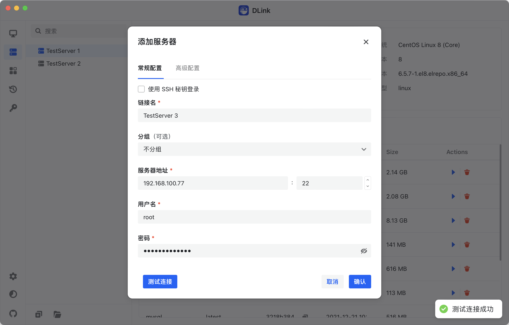
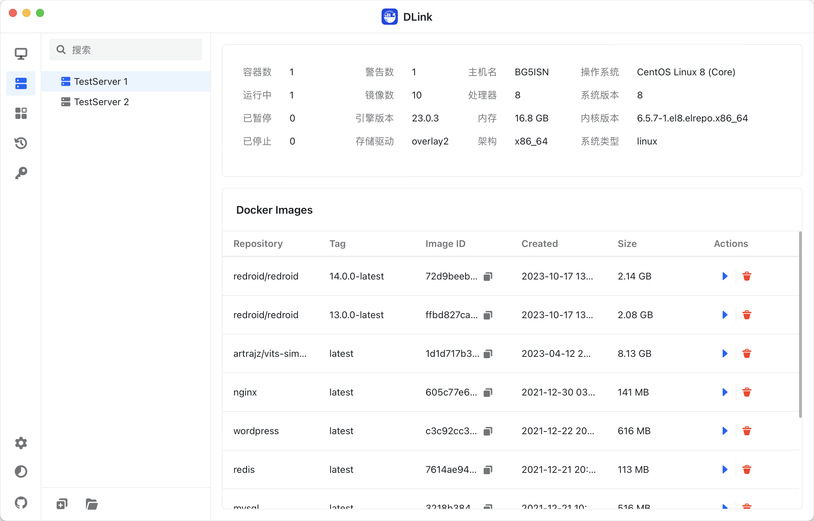
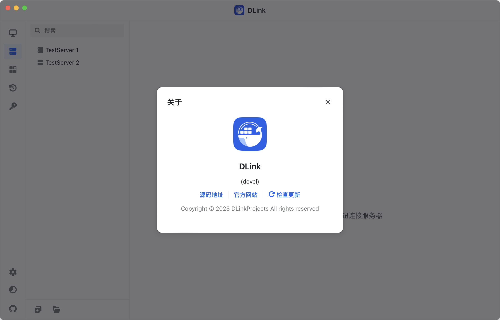

<h4 align="right"><strong><a href="https://github.com/DLinkProjects/DLink/blob/main/README.md">English</a></strong> | 简体中文</h4>

  

# DLink

_✨ 轻量级跨平台远程容器管理客户端 ✨_

    
    
    
    
    

  <a href="">文档</a>
  ·
  <a href="">下载</a>
  ·
  <a href="">问题反馈</a>
  ·
  <a href="">参与贡献</a>

>一个简单轻量的跨平台远程容器管理客户端，相关功能还在积极开发中，暂不提供下载。 

# 截图

# 贡献者

# 趋势
