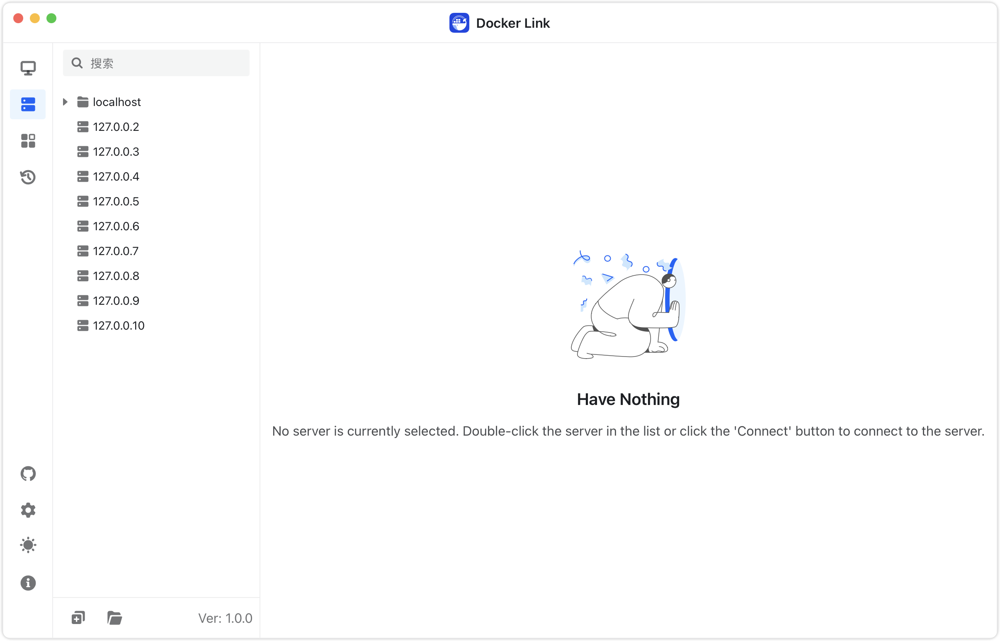

<h4 align="right"><strong><a href="https://github.com/DLinkProjects/DLink/blob/main/README-zh.md">中文 (Simplified Chinese)</a></strong> | English</h4>

<h1 align="center">Docker Link (In Development)</h1>

<strong>A simple, lightweight Docker desktop / remote Docker management tool, supporting Mac, Windows, and Linux. Currently not available for download, as related features are still actively in development.</strong>

