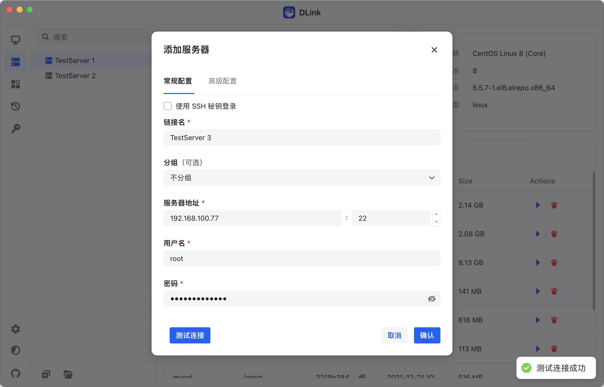

<h4 align="right"><strong><a href="https://github.com/DLinkProjects/DLink/blob/main/README-zh.md">中文 (Simplified Chinese)</a></strong> | English</h4>

  

# DLink

_✨ Lightweight Cross-Platform Remote Container Management Client ✨_

    
    
    
    
    

  <a href="">Docs</a>
  ·
  <a href="">Download</a>
  ·
  <a href="">Report</a>
  ·
  <a href="">Contribute Code</a>

>A simple and lightweight cross-platform remote container management client, with ongoing active development of related features. Download is not available at this time. 

# Screenshots

# Contributors

# Stargazers over time
